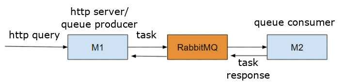

#  HTTP-AMQP microservice communication example app

An example `Node.js/TypeScript` app to show how to communicate between an `HTTP` microservice (`Express`) and an `AMQP 0-9-1` microservice (`RabbitMQ/`[`rabbitmq-client`](https://github.com/cody-greene/node-rabbitmq-client))

## Running app

To start HTTP microservice (`M1`), run:

 	npm run http

To start RabbitMQ microservice (`M2`), run:

 	npm run fibonacci

All incoming and finished requests for both microservices will be logged to console output using [`pino`](https://github.com/pinojs/pino); the output is prettified by default, no need to use `pino-pretty`.

## Environment variables

This app uses `dotenv-defaults`; default required variables are stored in `.env.defaults` file and should work by default, but should something needs to be changed, values in an `.env` file will take precedence.

Required environment variables:

	HTTP_PORT
	AMQP_URL

## API Reference

### GET `/fibonacci`

Will request and return a (fake) fibonacci value from a RabbitMQ microservice

#### Query `?n=[number]`

Determines the fibonacci number to be returned. Since there is no actual fibonacci computation happening, the RabbitMQ microservice will just wait for `n` seconds before returning `n`. If no value is provided, `n = 0`

#### Response

`Your fibonacci is: [n]`
